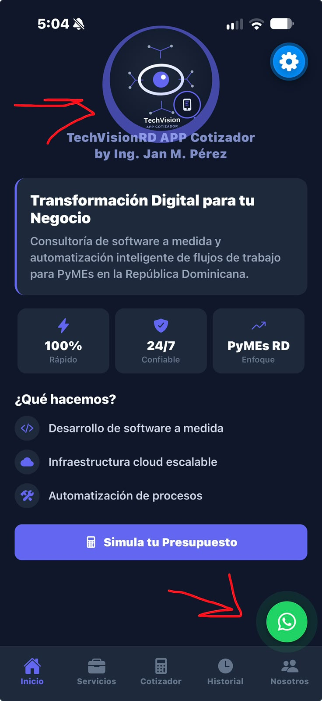
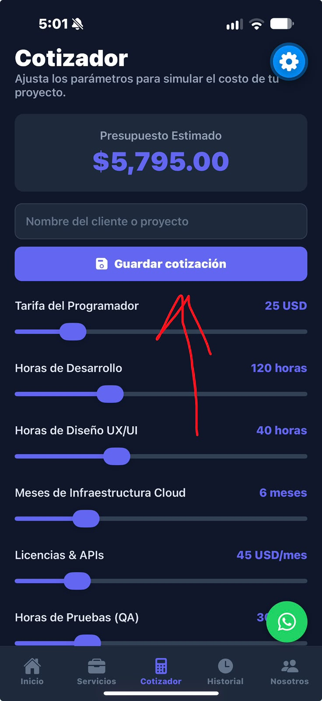
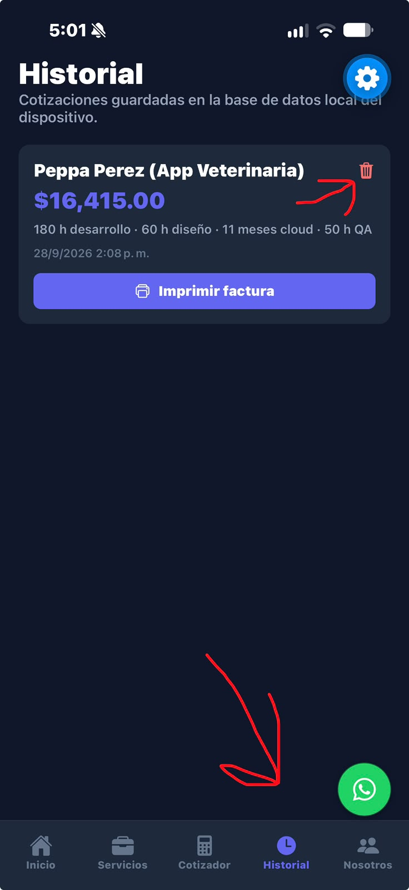
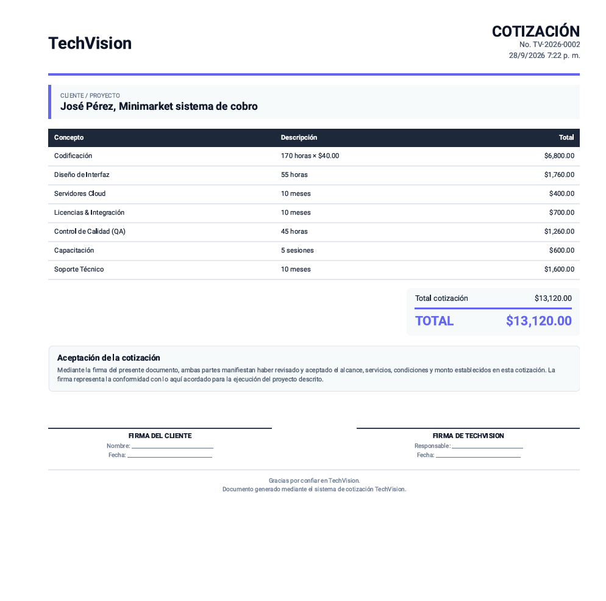

# TechVisionRD App Cotizador

Aplicación móvil desarrollada para **TechVision RD** como proyecto de implementación de software.

El sistema permite realizar cotizaciones de proyectos de desarrollo de software mediante diferentes parámetros, almacenar las cotizaciones realizadas y generar documentos de cotización en formato PDF.

---
## 📱 Capturas del sistema

<p align="center">
  
  
</p>

<p align="center">
  
  
</p>


## 🚀 Funcionalidades

- 🏠 **Inicio:** presentación de TechVision RD y del sistema.
- 💰 **Cotizador:** cálculo automático del presupuesto del proyecto.
- 📊 **Desglose de costos:** visualización detallada de los diferentes servicios.
- 💾 **Persistencia local:** almacenamiento de cotizaciones mediante SQLite.
- 📋 **Historial:** consulta de cotizaciones guardadas.
- 🗑️ **Eliminación:** eliminación de cotizaciones almacenadas.
- 🧾 **Generación de factura:** creación de documentos de cotización en formato PDF.
- 💬 **Contacto:** acceso directo mediante WhatsApp.

---

## 🧮 Parámetros del cotizador

El usuario puede modificar los siguientes parámetros:

| Parámetro | Descripción |
|---|---|
| Tarifa del programador | Valor por hora de desarrollo |
| Horas de desarrollo | Tiempo estimado de programación |
| Horas de diseño UX/UI | Tiempo destinado al diseño |
| Infraestructura Cloud | Cantidad de meses |
| Licencias & APIs | Costo mensual estimado |
| Horas de pruebas QA | Tiempo destinado al control de calidad |
| Sesiones de capacitación | Cantidad de sesiones |

El sistema recalcula automáticamente el presupuesto a medida que el usuario modifica los valores.

---

## 🛠️ Tecnologías utilizadas

| Tecnología | Uso |
|---|---|
| **React Native** | Desarrollo de la aplicación móvil |
| **Expo SDK 57** | Plataforma de desarrollo y compilación |
| **Expo Router** | Navegación entre pantallas |
| **JavaScript** | Lógica de la aplicación |
| **SQLite** | Persistencia local de las cotizaciones |
| **Expo Print** | Generación de documentos PDF |
| **React Native Slider** | Controles del cotizador |
| **Expo Vector Icons** | Iconografía de la aplicación |
| **EAS Build** | Generación de la aplicación Android |

---

## 🗄️ Base de datos

La aplicación utiliza **SQLite** para almacenar localmente las cotizaciones realizadas por el usuario.

Cada registro conserva información como:

- Cliente o proyecto.
- Tarifa del programador.
- Horas de desarrollo.
- Horas de diseño.
- Meses de infraestructura.
- Licencias y APIs.
- Horas de QA.
- Sesiones de capacitación.
- Total de la cotización.
- Fecha de creación.

---

## 📂 Estructura del proyecto

```text
techvision-app/
│
├── assets/
│   ├── 1logo.png
│   └── ...
│
├── db/
│   └── database.js
│
├── docs/
│   └── screenshots/
│       ├── inicio.png
│       ├── cotizador.png
│       ├── historial.png
│       └── factura.png
│
├── screens/
│   ├── CotizadorScreen.js
│   ├── HistorialScreen.js
│   ├── InicioScreen.js
│   ├── NosotrosScreen.js
│   └── ServiciosScreen.js
│
├── src/
│   ├── app/
│   ├── components/
│   ├── constants/
│   └── hooks/
│
├── app.json
├── eas.json
├── metro.config.js
├── package.json
├── package-lock.json
└── tsconfig.json
```

---

## ⚙️ Instalación y ejecución

### Requisitos

- [Node.js](https://nodejs.org/)
- npm
- Expo
- Expo Go para pruebas en Android

### 1. Clonar el repositorio

```bash
git clone https://github.com/perezgames/Seminario-de-Proyecto-2-Proyecto-TechVisionRD-APP-Cotizador.git
```

### 2. Entrar al proyecto

```bash
cd Seminario-de-Proyecto-2-Proyecto-TechVisionRD-APP-Cotizador
```

### 3. Instalar dependencias

```bash
npm install
```

### 4. Iniciar Expo

```bash
npx expo start
```

Para ejecutar directamente en Android:

```bash
npx expo start --android
```

---

## 📦 Aplicación Android

La versión compilada para Android está disponible en la sección **Releases** de este repositorio.

### Descargar APK

**[⬇️ Descargar TechVisionRD App Cotizador](../../releases/latest)**

---

## 🎓 Proyecto universitario

**Seminario de Proyecto II**

Proyecto desarrollado como parte del proceso de implementación y puesta en funcionamiento de una solución de software para **TechVision RD**.

### TechVision RD

> Soluciones de software orientadas a las necesidades de las empresas y sus proyectos tecnológicos.

---

## 👨‍💻 Estado del proyecto

**Versión:** 1.0.0  
**Plataforma principal:** Android  
**Estado:** Implementado y funcional
